<!-- =========================================================
     HEADER
========================================================= -->

<p align="center">
  <a href="https://github.com/Talal-Sharaa">
    
  </a>
</p>

<p align="center">
  <a href="https://www.linkedin.com/in/talal-alsharaa/">
    
  </a>
  <a href="mailto:talal.i.sharaa@gmail.com">
    
  </a>
  
</p>

---

## 👋 About Me

I'm a software engineer from Jordan who enjoys understanding **why systems behave the way they do**, not just making them work.

My interests sit around **backend engineering, software performance, developer tooling, automation, databases, observability, and practical AI-powered systems**.

I especially enjoy problems where I can trace something from a visible symptom down through the application, operating system, network, or database until I find the actual cause.

* 🔬 **Currently exploring:** Software Performance Engineering, profiling, observability, and systems internals
* 🧰 **I build with:** C#, TypeScript, JavaScript, Python, PowerShell, SQL, React, Node.js, and .NET
* 🗄️ **Databases:** PostgreSQL and SQL Server
* 🐳 **Infrastructure:** Docker, GitHub Actions, Linux, Grafana, and related tooling
* 🧠 **I care about:** Performance, reliability, clean architecture, automation, and maintainable software
* 🐞 **Favorite kind of work:** Debugging problems that initially make no sense
* 🐱 **Fun fact:** I have a son called **Hope**. He is a cat.

---

## 🚀 Featured Projects

<p align="center">
  <a href="https://github.com/Talal-Sharaa/WinAdvisor">
    
  </a>
  <a href="https://github.com/Talal-Sharaa/MoviesWorkshop">
    
  </a>
</p>

<p align="center">
  <a href="https://github.com/Talal-Sharaa/Moqat3a">
    
  </a>
</p>

### 🪟 [WinAdvisor](https://github.com/Talal-Sharaa/WinAdvisor)

**Adaptive Windows 11 diagnostics, maintenance, and cleanup orchestration.**

Instead of blindly applying a fixed list of "optimizations," WinAdvisor inspects the machine it is running on, gathers evidence, explains its findings, and proposes actions that actually apply to that system.

Its design centers around **safe execution, explicit approval, risk classification, rollback, read-only analysis, and delegation to native/vendor tools**.

`PowerShell` · `Windows 11` · `Diagnostics` · `Automation` · `System Administration`

---

### 🎬 [MoviesWorkshop](https://github.com/Talal-Sharaa/MoviesWorkshop)

**A local, cross-platform video workshop powered by FFmpeg.**

MoviesWorkshop burns styled subtitles and compresses movies below predictable target sizes using **CPU two-pass encoding or NVIDIA NVENC**, with automatic subtitle sizing, Arabic/non-Arabic text detection, output validation, and an interactive preview loop.

Everything stays local to the machine.

`Python` · `FFmpeg` · `NVENC` · `H.264 / H.265` · `CLI` · `Cross-platform`

---

### 🔎 [Moqat3a](https://github.com/Talal-Sharaa/Moqat3a)

A web application for researching companies and discovering alternative products or companies based on documented business relationships.

The project focuses on making the underlying information easier to search, navigate, and contribute to.

`JavaScript` · `HTML` · `CSS` · `Web`

---

## 🛠️ Tech Stack

### Languages

<p>
  
  
  
  
  
  
</p>

### Application Development

<p>
  
  
  
  
  
</p>

### Data & Infrastructure

<p>
  
  
  
  
  
  
</p>

---

## 📊 GitHub

<p align="center">
  
  
</p>

---

## ⏱️ Coding Activity

<details>
  <summary><b>📊 View detailed weekly development activity</b></summary>

<br />

<!--START_SECTION:waka-->


**🐱 My GitHub Data** 

> 📦 272.0 kB Used in GitHub's Storage 
 > 
> 🏆 146 Contributions in the Year 2026
 > 
> 🚫 Not Opted to Hire
 > 
> 📜 54 Public Repositories 
 > 
> 🔑 28 Private Repositories 
 > 
**I'm an Early 🐤** 

```text
🌞 Morning                139582 commits      ██████░░░░░░░░░░░░░░░░░░░   22.98 % 
🌆 Daytime                296299 commits      ████████████░░░░░░░░░░░░░   48.77 % 
🌃 Evening                137273 commits      ██████░░░░░░░░░░░░░░░░░░░   22.60 % 
🌙 Night                  34329 commits       █░░░░░░░░░░░░░░░░░░░░░░░░   05.65 % 
```
📅 **I'm Most Productive on Wednesday** 

```text
Monday                   95826 commits       ████░░░░░░░░░░░░░░░░░░░░░   15.77 % 
Tuesday                  106498 commits      ████░░░░░░░░░░░░░░░░░░░░░   17.53 % 
Wednesday                135154 commits      ██████░░░░░░░░░░░░░░░░░░░   22.25 % 
Thursday                 79538 commits       ███░░░░░░░░░░░░░░░░░░░░░░   13.09 % 
Friday                   49597 commits       ██░░░░░░░░░░░░░░░░░░░░░░░   08.16 % 
Saturday                 48095 commits       ██░░░░░░░░░░░░░░░░░░░░░░░   07.92 % 
Sunday                   92775 commits       ████░░░░░░░░░░░░░░░░░░░░░   15.27 % 
```


📊 **This Week I Spent My Time On** 

```text
🕑︎ Time Zone: Asia/Amman

💬 Programming Languages: 
Markdown                 18 hrs 26 mins      █████████░░░░░░░░░░░░░░░░   36.62 % 
C#                       8 hrs 32 mins       ████░░░░░░░░░░░░░░░░░░░░░   16.94 % 
PowerShell               7 hrs               ███░░░░░░░░░░░░░░░░░░░░░░   13.93 % 
Other                    4 hrs 25 mins       ██░░░░░░░░░░░░░░░░░░░░░░░   08.78 % 
Python                   2 hrs 36 mins       █░░░░░░░░░░░░░░░░░░░░░░░░   05.17 % 

🔥 Editors: 
Claude Code              43 hrs 48 mins      ██████████████████████░░░   86.96 % 
VS Code                  5 hrs 38 mins       ███░░░░░░░░░░░░░░░░░░░░░░   11.18 % 
Codex Vscode             56 mins             ░░░░░░░░░░░░░░░░░░░░░░░░░   01.86 % 

🐱‍💻 Projects: 
SkaFixMonitor            17 hrs 58 mins      █████████░░░░░░░░░░░░░░░░   35.69 % 
ZagTraderInsightsWebApp  15 hrs 57 mins      ████████░░░░░░░░░░░░░░░░░   31.68 % 
HousingBankBridge        5 hrs 7 mins        ███░░░░░░░░░░░░░░░░░░░░░░   10.18 % 
WinAdvisor               2 hrs 43 mins       █░░░░░░░░░░░░░░░░░░░░░░░░   05.42 % 
Windows11Optimization    2 hrs 37 mins       █░░░░░░░░░░░░░░░░░░░░░░░░   05.22 % 

💻 Operating System: 
Windows                  50 hrs 23 mins      █████████████████████████   100.00 % 
```

🤖 **AI Coding This Week** 

```text
⏱ AI Coding Time: 48 hrs 38 mins (96.54%)

✍️ 88,945 lines written by AI, 369 lines written by hand (99.59% AI-written)

🔤 24,240,622 Input Tokens, 4,087,901 Output Tokens

💵 $993.14 Estimated AI Cost This Week

🧠 97 AI Sessions, 269 AI Prompts

Opus                     89,601 lines        █████████████████████████   99.50 % 
GPT                      451 lines           ░░░░░░░░░░░░░░░░░░░░░░░░░   00.50 % 
Claude-Code              0 lines             ░░░░░░░░░░░░░░░░░░░░░░░░░   00.00 % 

🔎 AI Coding Insights:
🤖 AI-Driven — 99.59% of written lines came from AI
📚 Verbose Prompter — average 7,039 characters per prompt
🔁 Iterative Prompter — average 3 prompts per session
🚀 High AI Trust — 0.96% of changed lines were hand-edited
```

**I Mostly Code in JavaScript** 

```text
JavaScript               21 repos            ████████░░░░░░░░░░░░░░░░░   30.00 % 
TypeScript               11 repos            ████░░░░░░░░░░░░░░░░░░░░░   15.71 % 
C#                       11 repos            ████░░░░░░░░░░░░░░░░░░░░░   15.71 % 
Python                   4 repos             █░░░░░░░░░░░░░░░░░░░░░░░░   05.71 % 
PowerShell               3 repos             █░░░░░░░░░░░░░░░░░░░░░░░░   04.29 % 
```


**Timeline**


 Last Updated on 24/09/2026 23:36:50 UTC
<!--END_SECTION:waka-->

</details>

---

## 🏅 LeetCode

<p align="center">
  <a href="https://leetcode.com/TalalSharaa/">
    
  </a>
</p>

---

## 🐍 Contributions

<p align="center">
  <picture>
    <source
      media="(prefers-color-scheme: dark)"
      srcset="https://github.com/Talal-Sharaa/Talal-Sharaa/blob/output/github-snake-dark.svg"
    />
    <source
      media="(prefers-color-scheme: light)"
      srcset="https://github.com/Talal-Sharaa/Talal-Sharaa/blob/output/github-snake.svg"
    />
    
  </picture>
</p>

---

## 📚 Currently Reading


<!-- GOODREADS-LIST:START -->
> 📖 **[11/22/63](https://www.goodreads.com/review/show/8955355628?utm_medium=api&utm_source=rss)** — Stephen  King
<!-- GOODREADS-LIST:END -->

---

## 🎧 Now Playing

<p align="center">
  <a href="https://spotify-github-profile.kittinanx.com/api/view?uid=31cpwkqy33qtstgcroqsfuyxuk4m&redirect=true">

  </a>
</p>

---

## 🤝 Connect

<p align="center">
  <a href="https://www.linkedin.com/in/talal-alsharaa/">
    
  </a>
  <a href="mailto:talal.i.sharaa@gmail.com">
    
  </a>
  <a href="https://leetcode.com/TalalSharaa/">
    
  </a>
</p>

<p align="center">
  <i>
    Open to talking about software performance, backend engineering,
    developer tooling, AI, or particularly difficult bugs.
  </i>
</p>

<p align="center">
  🐱
</p>
